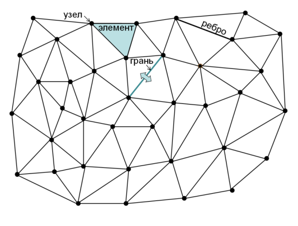

# Параллельные методы решения задач

## 1. Многопоточная реализация операций с сеточными данными на неструктурированной смешанной сетке, решение СЛАУ

### Цели проекта 1

1. Освоение базовых структур данных для представления неструктурированной сетки, графа связей расчетных ячеек, портрета разреженной матрицы
2. Постижение взаимосвязи между сеткой, графом и разреженной матрицей
3. Освоение многопоточного распараллеливания

### Введение

Для дискретизации по пространству используется неструктурированная сетка. Сетка – это разбиение некоторой пространственной расчетной области на сеточные элементы (в двухмерном случае – многоугольники, далее в проекте будем рассматривать двумерный случай).

Сетка задана в виде набора узлов и элементов (ячеек).

Объединение сеточных элементов полностью заполняет расчетную область, а сами элементы не наползают друг на друга, а стыкуются через общие грани (ребро в двумерном случае) и узлы.

Пример расчетной сетки с треугольными ячейками:

### Постановка задачи

Работа программы состоит из 4-х частей:
1. **Generate** - генерация графа/портрета по тестовой сетке
2. **Fill** - заполнение матрицы по заданному портрету
3. **Solve** - решение СЛАУ с полученной матрицей
4. **Report** - проверка корректности программы и выдача измерений

